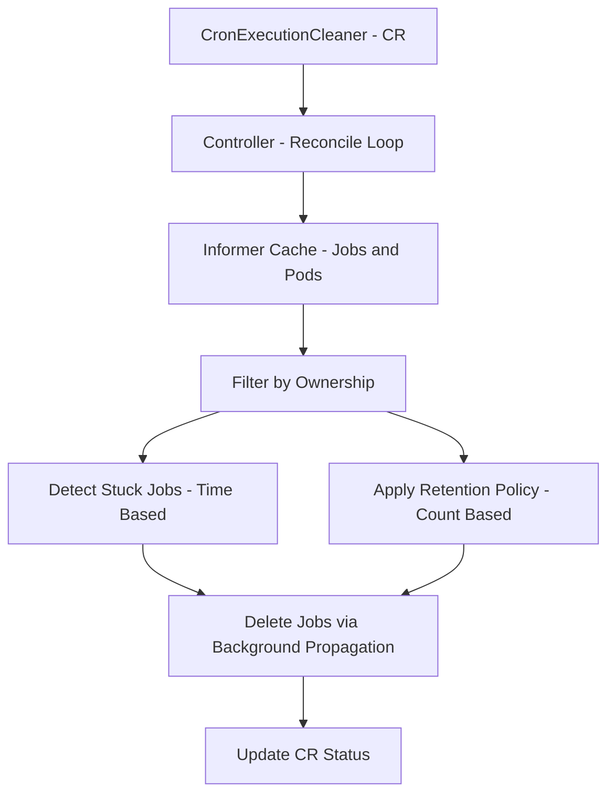

# Cron Execution Cleaner Operator
A Kubernetes operator that automatically cleans up stuck and excess CronJob executions
(Jobs and Pods) based on user-defined lifecycle policies.

This project was built from a real production issue where CronJob executions entered error
or hung states and were never cleaned up, leading to unbounded Jobs and Pods in the cluster.

## Description

### Problem

Kubernetes CronJobs create a new Job (and Pod) on every schedule.
While Kubernetes provides basic history limits, it does not handle:

- Long-running or hung Jobs
- Executions stuck in Active state
- Fine-grained retention policies
- Explicit lifecycle cleanup semantics

Over time, this leads to:

- Orphaned Jobs
- Accumulating Pods
- Wasted cluster resources

### Solution

The Cron Execution Cleaner Operator introduces a Custom Resource,
CronExecutionCleaner, that allows users to define explicit lifecycle policies
for CronJob executions.

#### The controller:

- Watches cleanup policies via a CRD
- Lists Jobs using informer-backed caches
- Filters Jobs using ownership (CronJob → Job → Pod)
- Detects stuck executions using time-based rules
- Enforces retention limits for completed Jobs
- Deletes Jobs safely with cascading Pod cleanup
- Reports actions via CR status

### High-Level Architecture
The operator follows a standard Kubernetes reconcile pattern driven by a
custom resource that defines cleanup policies.


### Custom Resource Example
```yaml
apiVersion: lifecycle.github.io/v1alpha1
kind: CronExecutionCleaner
metadata:
  name: stuck-cron-cleaner
spec:
  namespace: cron-test
  cronJobName: stuck-cron

  retain:
    successfulJobs: 3
    failedJobs: 3

  cleanupStuck:
    enabled: true
    stuckAfter: 2h

  runInterval: 5m
```
### How “Stuck” Jobs Are Detected

A Job is considered stuck if all of the following are true:

- `status.active` > 0
- `status.succeeded` == 0
- `status.failed` == 0
- The Job has been running longer than `cleanupStuck.stuckAfter`

This logic relies on Job controller semantics (`status.startTime`) rather than
Pod-level heuristics.

### Retention Policy

For completed Jobs:

- Keep the **N most recent successful Jobs**
- Keep the **M most recent failed Jobs**
- Delete older executions (oldest first)

Retention is enforced independently from stuck-job cleanup.

### Status Reporting

The operator updates the `CronExecutionCleaner` status with:

- `lastRunTime`

- `jobsDeleted`

- `podsDeleted`

This provides visibility into cleanup actions and makes the operator easy to observe
and debug.

### Safety Guarantees

- Namespace-scoped
- CronJob-scoped
- Ownership-based selection
- No cluster-wide deletions
- Explicit retention and timeout policies
- Cascading deletion handled by Kubernetes

## Getting Started

### Prerequisites
- Go v1.21+
- Docker
- kubectl
- Access to a Kubernetes cluster(Kind, Minikube, etc.)
- Kubebuilder

### Run Locally (Recommended for Development)
Run the controller locally against your kubeconfig:
```sh
make install
make run
```

### Deploy to a Cluster
**Build and push the controller image:**

```sh
make docker-build docker-push IMG=<some-registry>/cron-execution-cleaner:tag
```

**NOTE:** This image ought to be published in the personal registry you specified. 
And it is required to have access to pull the image from the working environment. 
Make sure you have the proper permission to the registry if the above commands don’t work.

**Install the CRDs into the cluster:**

```sh
make install
```

**Deploy the controller**

```sh
make deploy IMG=<some-registry>/cron-execution-cleaner:tag
```

> **NOTE**: If you encounter RBAC errors, you may need to grant yourself cluster-admin 
privileges or be logged in as admin.

**Create Cleaner Resource**
You can apply the samples (examples) from the config/sample:

```sh
kubectl apply -k config/samples/
```

>**NOTE**: Ensure that the samples has default values to test it out.

### Cleanup / Uninstall
**Delete the instances (CRs) from the cluster:**

```sh
kubectl delete -k config/samples/
```

**Delete the APIs(CRDs) from the cluster:**

```sh
make uninstall
```

**UnDeploy the controller from the cluster:**

```sh
make undeploy
```

## Future Roadmap

- Finalizers
- Prometheus Metrics
- Dry-run mode
- Helm chart
- Unit and e2e tests
- Support for multiple CronJobs per CR

## Contributing
Contributions are welcome.
Please:

- Open an issue to discuss changes
- Keep PRs focused and well-scoped
- Follow existing controller patterns

**NOTE:** Run `make help` for more information on all potential `make` targets

## License

MIT
