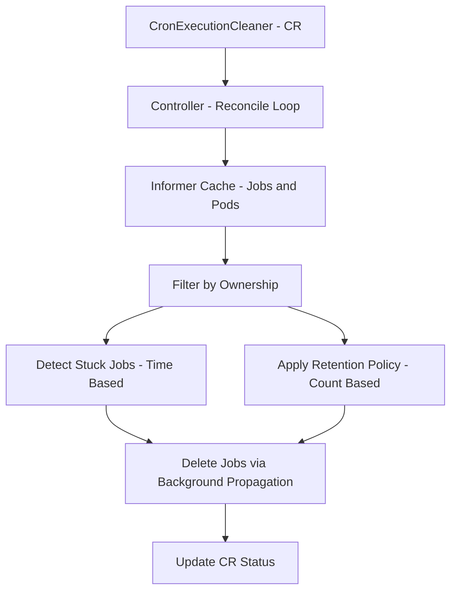

# Cron Execution Cleaner Operator


A Kubernetes operator that automatically cleans up stuck and excess CronJob executions
(Jobs and Pods) based on user-defined lifecycle policies.

This project was built from a real production issue where CronJob executions entered error
or hung states and were never cleaned up, leading to unbounded Jobs and Pods in the cluster.

## Description

### Problem

Kubernetes CronJobs create a new Job (and Pod) on every schedule.
While Kubernetes provides basic history limits, it does not handle:

- Long-running or hung Jobs
- Executions stuck in Active state
- Fine-grained retention policies
- Explicit lifecycle cleanup semantics

Over time, this leads to:

- Orphaned Jobs
- Accumulating Pods
- Wasted cluster resources

### Solution

The Cron Execution Cleaner Operator introduces a Custom Resource,
CronExecutionCleaner, that allows users to define explicit lifecycle policies
for CronJob executions.

### High-Level Architecture
The operator follows a standard Kubernetes reconcile pattern driven by a
custom resource that defines cleanup policies.



### Deployment Architecture

The operator is deployed to `cron-execution-cleaner-system` namespace but operates 
on Jobs/Pods in **user-specified namespaces**. This provides:
- Isolation: Operator cannot interfere with cluster system components
- Multi-tenancy: Single operator instance manages multiple namespaces
- Least privilege: Explicit RBAC for each namespace

### Custom Resource Example
```yaml
apiVersion: lifecycle.github.io/v1alpha1
kind: CronExecutionCleaner
metadata:
  name: stuck-cron-cleaner
spec:
  namespace: cron-test
  cronJobName: stuck-cron

  retain:
    successfulJobs: 3
    failedJobs: 3

  cleanupStuck:
    enabled: true
    stuckAfter: 2h

  runInterval: 5m
```

#### The controller:

- Watches cleanup policies via a CRD
- Lists Jobs using informer-backed caches
- Filters Jobs using ownership (CronJob → Job → Pod)
- Detects stuck executions using time-based rules
- Enforces retention limits for completed Jobs
- Deletes Jobs safely with cascading Pod cleanup
- Reports actions via CR status

### Reconciliation Cycle

The controller reconciles based on `spec.runInterval`. For example, with `runInterval: 5m`:
- Cleanup check runs every 5 minutes
- Between cycles, no cleanup occurs even if conditions are met
- This prevents excessive API calls and provides predictable cleanup timing


### How “Stuck” Jobs Are Detected

A Job is considered stuck if all of the following are true:

- `status.active` > 0
- `status.succeeded` == 0
- `status.failed` == 0
- The Job has been running longer than `cleanupStuck.stuckAfter`

This logic relies on Job controller semantics (`status.startTime`) rather than
Pod-level heuristics.

### Retention Policy

For completed Jobs:

- Keep the **N most recent successful Jobs**
- Keep the **M most recent failed Jobs**
- Delete older executions (oldest first)

**Important:** Jobs without `status.startTime` are treated as oldest and deleted first.

Retention is enforced independently from stuck-job cleanup.

### Status Reporting

The operator updates the `CronExecutionCleaner` status with:

- `lastRunTime`

- `jobsDeleted`

- `podsDeleted`

This provides visibility into cleanup actions and makes the operator easy to observe
and debug.

### Safety Guarantees

- Namespace-scoped
- CronJob-scoped
- Ownership-based selection
- No cluster-wide deletions
- Explicit retention and timeout policies
- Cascading deletion handled by Kubernetes

### Important: Cascading Deletion Behavior

The operator uses Kubernetes' `DeletePropagationBackground` policy:
- Jobs are deleted immediately
- Associated Pods are cleaned up asynchronously
- **WARNING**: Once a Job is deleted, there is no recovery mechanism. 
Ensure your retention policies are appropriate before enabling cleanup.

### Limitations

- One `CronExecutionCleaner` resource per CronJob
- Assumes 1:1 Job:Pod ratio
- No dry-run mode available

## Getting Started

### Prerequisites
- Go v1.21+
- Docker
- kubectl
- Kubernetes: 1.26+
- Access to a Kubernetes cluster(Kind, Minikube, etc.)
- Kubebuilder

### Resource Requirements

The controller requires:
- **CPU**: 10m (request) / 500m (limit)
- **Memory**: 64Mi (request) / 128Mi (limit)

See `config/manager/manager.yaml` for details.

### Run Locally (Recommended for Development)
Run the controller locally against your kubeconfig:
```sh

# Install the CRD (register the template)
# This makes Kubernetes understand what a "CronExecutionCleaner" is
make install
make run
```

### Deploy to a Cluster (Optional, if you don't want to run the code locally)
**Build and push the controller image:**

```sh
make docker-build docker-push IMG=<your-registry>/cron-execution-cleaner:tag
```

**NOTE:** Replace `<your-registry>` with your container registry (e.g., `docker.io/username`, `gcr.io/project-id`).
Ensure you have push permissions to the registry.

**Install the CRDs into the cluster:**

```sh
make install
```

**Deploy the controller**

```sh
make deploy IMG=<your-registry>/cron-execution-cleaner:tag
```

> **NOTE**: If you encounter RBAC errors, you may need to grant yourself cluster-admin 
privileges or be logged in as admin.

**Verify the controller is running:**

```sh
kubectl get deployment -n cron-execution-cleaner-system
kubectl logs -n cron-execution-cleaner-system deployment/controller-manager
```

### Create Cleaner Resource
First, review the sample configuration:

```sh
cat config/samples/lifecycle_v1alpha1_cronexecutioncleaner.yaml
```

Customize the sample if needed (namespace, cronJobName, retention policy, etc.), then apply:

```sh
# Create a CR (deploy an instance)
kubectl apply -k config/samples/ 
# Alternatively, kubectl apply -f config/samples/lifecycle_v1alpha1_cronexecutioncleaner.yaml
```

**Verify the resource was created:**

```sh
# List all CRs of this type
kubectl get cronexecutioncleaner
# Shows: stuck-cron-cleaner

# Get a specific CR
kubectl get cronexecutioncleaner stuck-cron-cleaner -o yaml
# Shows the configuration and status of this specific instance
```

Wait for the next reconciliation cycle (based on `runInterval`) to see cleanup actions.

### Status Example

After one cycle runs, check the CR status:

```sh
kubectl get cronexecutioncleaner stuck-cron-cleaner -o yaml
```

Expected status output:
```yaml
status:
  jobsDeleted: 5
  podsDeleted: 5
  lastRunTime: "2026-01-07T10:30:00Z"
  conditions:
  - type: Ready
    status: "True"
    reason: ReconcileSuccess
    message: Cleanup executed successfully
    lastTransitionTime: "2026-01-07T10:30:00Z"
```

### Cleanup / Uninstall
**Delete the instances (CRs) from the cluster:**

```sh
kubectl delete -k config/samples/
```

**Delete the CRDs from the cluster:**

```sh
make uninstall
```

**Undeploy the controller from the cluster:**

```sh
make undeploy
```
### Troubleshooting

**Jobs not being deleted:**
- Check controller logs: `kubectl logs -n cron-execution-cleaner-system deployment/controller-manager`
- Verify RBAC: `kubectl auth can-i delete jobs --as=system:serviceaccount:cron-execution-cleaner-system:controller-manager`
- Confirm Job ownership: `kubectl get jobs -o jsonpath='{.items[*].metadata.ownerReferences}'`

**Controller pod not running:**
- Insufficient RBAC permissions
- CRD not installed: `make install`

---

## E2E Testing (Kind)

The project includes end-to-end (e2e) tests generated using Kubebuilder.
These tests create and manage a Kind cluster automatically and validate the controller behavior against a real Kubernetes API.

This is the recommended and easiest way to run e2e tests locally.

### Prerequisites

Make sure the following tools are installed:

- Go (1.21+)
- Docker
- kubectl
- Kind
- Kubebuilder

**Verify:**

```sh
docker version
kubectl version --client
kind version
kubebuilder version
```

**Step 1: Create a Kind cluster named `kind`**

```sh
kind create cluster --name kind
```
**Verify:**

```sh
kubectl cluster-info
```

**Step 2: Run the e2e tests**

From the repository root:

```sh
go test ./test/e2e -tags=e2e -v
```

**What this does:**

- Builds the controller image
- Loads the image into the Kind cluster
- Installs CRDs
- Deploys the controller
- Creates test resources
- Validates reconcile behavior
- Cleans up automatically

**Step 3: Clean up (optional)**

Delete the Kind cluster when done:

```sh
kind delete cluster --name kind
```

## Future Roadmap

- Prometheus Metrics
- Dry-run mode (validate policies without deletion)
- Helm chart
- Support for multiple CronJobs per CR
- Finalizers for CR cleanup on deletion

## Contributing

Contributions are welcome.
Please:

- Open an issue to discuss changes
- Keep PRs focused and well-scoped
- Follow existing controller patterns

**NOTE:** Run `make help` for more information on all potential `make` targets

## License

MIT
